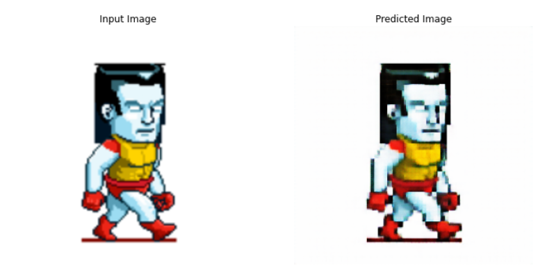

# Pixel-art-generation
ISTE CRYPT project done in 2nd year Btech. 

Assets were generated using CycleGan to pixelate and then used to create a game.

## Datasets
#### Label A :

dataset 1: https://www.kaggle.com/lijiyu/imagenet

dataset 2: https://www.kaggle.com/sarthak4u/aimages

#### Label B:

dataset 1: https://www.kaggle.com/sarthak4u/bimages

dataset 2: https://drive.google.com/file/d/1ko4sGkiIppFH9248_7LVYiyHpzU6OFQp/view?usp=sharing

## Best Results Are Obtained Using 

##### Datasets :

Train :

Label A : https://www.kaggle.com/lijiyu/imagenet

Label B : https://drive.google.com/file/d/1ko4sGkiIppFH9248_7LVYiyHpzU6OFQp/view?usp=sharing

##### Epochs  : 10

##### Lambda (learning rate)  : 10

##### Batch Size : 10

